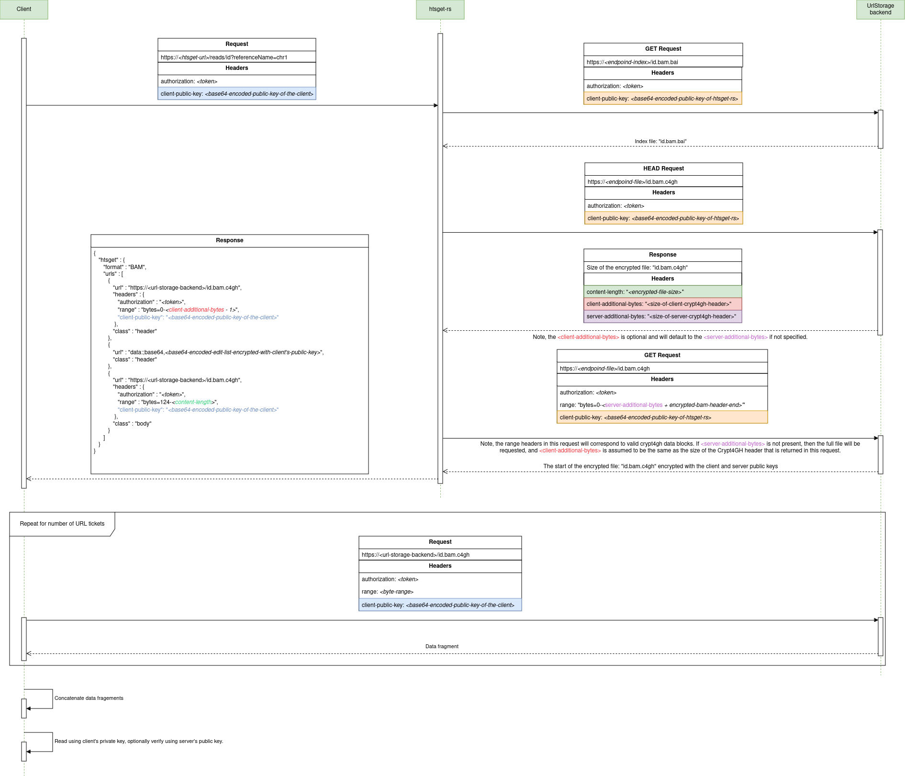

# Crypt4GH and htsget-rs

Crypt4GH is a block-level encryption scheme that encrypts data in 64KiB blocks, and supports indexed reading of genomic data.
Currently, htsget-rs supports returning Crypt4GH encrypted data using `UrlStorage` and a custom protocol that defines 
how the client, htsget-rs server, and `UrlStorage` server backend should interact.

Assuming that data is stored in the `UrlStorage` backend encrypted, the aim of this protocol is for the client to receive 
encrypted data via htsget-rs, which ought to be able to calculate the correct byte ranges according to the query.

## The htsget-rs server

In order for htsget-rs to do this, it needs a few pieces of information:
1. It needs all the usual information to calculate byte ranges for a normal htsget query on unencrypted data. This includes:
    * The index file matching the queried file. Indexes are used by htsget-rs to calculate the closest byte ranges that include
      the data requested in the query. For example, these indexes are BAI, TABIX, CRAI and CSI files.
    * The header of the queried file. This header is used by htsget-rs to map a reference name in the query to the corresponding
      index position. For example, these headers are lines at the beginning BAM files that start with `@`, or lines at the beginning.
      of VCF files that start with `##`.
    * The size of the queried file. The file size is used to simply certain queries and for queries that involve byte ranges that
      go to the end of the file. For example, this is the size of the BAM, CRAM, VCF, or BCF file.
2. It also needs the size of the Crypt4GH header which the client will use to decrypt the data. Because each Crypt4GH
   file has a header at the start, this is needed in order to calculate byte ranges that align to the 64KiB Crypt4GH boundaries.

With this information, htsget-rs can calculate the correct byte ranges to return to the client, who in cooperation with the `UrlStorage`
backend can fetch the required data and decrypt it. With this approach, the htsget-rs server needs minimal information to 
process the request by passing public key information, which is used by htsget-rs and the `UrlStorage` backend to encrypt
data for the client.

The htsget-rs server can pass client information to the backend, such as the client's public key, alongside its own public
key in order to receive all the information it requires to calculate byte ranges. With this information, htsget-rs can
return the Crypt4GH header for the client, and an edit list, alongside byte ranges, in order for the client to concatenate
and decrypt the data.

## The protocol

The protocol starts when the client queries the htsget-rs server. The client sends their public key in a header called
`client-public-key`, which is base64 encoded. From here the htsget-rs queries the `UrlStorage` backend in three separate
requests. All requests forward the `client-public-key` and any additional headers from the client, as well as the server's
public key, which is base64 encoded in a header called `server-public-key`. Assuming the query is for a BAM file called `id`, and
the resolvers do not transform the id, the requests are:

1. A GET request to fetch the index of the queried file at: `https://<i><endpoint-index></i>/id.bam.bai`.
2. A HEAD request to get the **encrypted** file size at: `https://<i><endpoint-file></i>/id.bam.c4gh`.
3. A GET request to get the start of the **encrypted** file containing a Crypt4GH header and the BAM header, at: `https://<i><endpoint-file></i>/id.bam.c4gh`.
   1. This requests has additional headers to specify byte ranges for the start of the file: `range: "bytes=0-<encrypted-bam-header-end>`".
   2. This request also gets the size of the Crypt4GH header, which is assumed to be the same size the client requests it in the first URL ticket,
      with byte ranges: `range: "bytes=0-<crypt4gh-header-length>"`.

Here, `<endpoint-index>` and `<endpoint-file>` can be defined in the htsget config. Currently, htsget-rs implements this design.

The following is a diagram of this process:

### Alternative designs

For [request 3](#3) an alternative is to instead decouple returning the start of the file and returning the size of the
Crypt4GH header. An additional endpoint could be introduced (e.g. `<endpoint-crypt4gh-header-size>`) which just fetches
size of the header. This has the advantage of not requiring the Crypt4GH header returned in [request 3](#3) to be the same
size as the Crypt4GH header that the client expects in the URL tickets, at the cost of additional implementation logic.

Additionally, in [request 3](#3), an alternative would be return unencrypted header data directly, howevever this has the
disadvantage of not using Crypt4GH for the `htsget-rs <-> UrlStorage` portion of the data transfer. This would also require
a `<endpoint-crypt4gh-header-size>` in order to obtain the size of the Crypt4GH header.

In general, it is simple to convert unencrypted byte positions to encrypted byte positions, and vice versa, so it's not
as important whether the size and range returned by `UrlStorage` is unencrypted or encrypted.

Other designs could explore the client or the `UrlStorage` backend doing more work in terms of calculating byte ranges.
For example, the htsget-rs server could return unencrypted byte ranges which the client needs to convert into encrypted
byte ranges. This is further complicated by the edit lists, which the client would need to obtain or calculate to discard the correct
bytes after decrypting. With the current design, it is convenient to place this logic in htsget-rs because the htsget
already contains logic for byte range calculations for unencrypted data.

